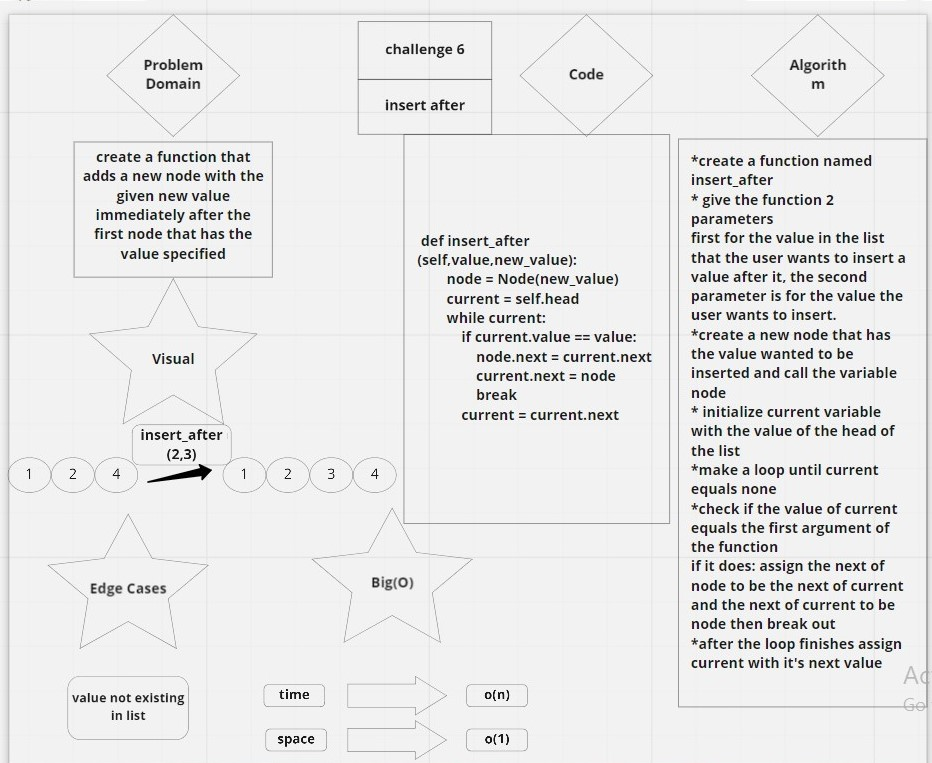
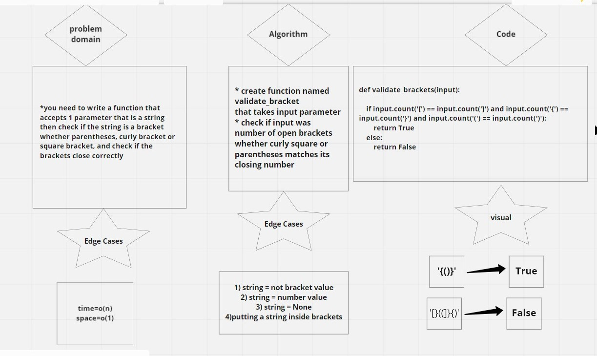

### PULL REQUEST TO CODE CHALLENGE 5
(https://github.com/FirasHasan/401-data-structures-and-algorithms/pull/4)

### LINK TO PULL REQUEST Code Challenge 8
(https://github.com/FirasHasan/401-data-structures-and-algorithms/pull/2)
### PULL REQUEST CHALLENGE 10
(https://github.com/FirasHasan/401-data-structures-and-algorithms/pull/3)

### CHALLENGE 6 
# link to miro
(https://miro.com/app/board/o9J_l5exNKI=/)
# Challenge Summary
- write three functions for linked lists the first is appending to the end of the cell
    - second is to insert a new value before a specific value in the list
    - third is to insert a new value after a specific value in the list

## Whiteboard Process
<!-- Embedded whiteboard image -->
.jpg)

## Approach & Efficiency
time is O(n)
space is O(1)

## Solution
it runs just fine i included the code in the white board and also in these files
all functions are tested and everything runs perfectly

# CHALLENGE 7
# link to pull request:
(https://github.com/FirasHasan/401-data-structures-and-algorithms/pull/9)

# link to miro
(https://miro.com/app/board/o9J_l5exNKI=/)

# Challenge Summary
create a function that has a method that Return the node’s value that is k places from the tail of the linked list.

## Whiteboard Process
<!-- Embedded whiteboard image -->

## Approach & Efficiency
time is O(n)
space is O(1)

## Solution
it runs just fine i included the code in the white board and also in these files
all functions are tested and everything runs perfectly

# CHALLENGE 8

# link to miro
(https://miro.com/app/board/o9J_l5exNKI=/)

# Challenge Summary
need to make a function that Zip the two linked lists together into one so that the nodes alternate between the two lists and return a reference to the head of the zipped list.

## Whiteboard Process
<!-- Embedded whiteboard image -->
.jpg)

## Approach & Efficiency
time is O(n)
space is O(n)

## Solution
it runs just fine i included the code in the white board and also in these files
a test runs and passes successfully

# CHALLENGE 13

# Challenge Summary
<!-- Description of the challenge -->
*you need to write a function that accepts 1 parameter that is a string
then check if the string is a bracket whether parentheses, curly bracket or square bracket, and check if the brackets close correctly

## Whiteboard Process
<!-- Embedded whiteboard image -->

## Approach & Efficiency
<!-- What approach did you take? Why? What is the Big O space/time for this approach? -->
time is o(n)
space is o(1)

## Solution
<!-- Show how to run your code, and examples of it in action -->
it runs just fine i included the code in the white board and also in these files
3 tests runs and passes successfully

# code chellenge 15 TREES
[click for link to pull request:](https://github.com/FirasHasan/401-data-structures-and-algorithms/pull/13)

# Trees
- Trees are nonlinear data structures.
- A tree can be empty with no nodes.
- Trees can be traversed with either depth first or breadth first.

## Challenge
<!-- Description of the challenge -->
Need to make a class that will be responsible for creating nodes, another binary tree class which will traverse using tree methods: InOrder,PreOrder and PostOrder. the last class will be binary search tree class which will know exactly where to put whatever value we want to store in the tree in its right place. this class will also have another method to check if the value already exists in the tree.
## Approach & Efficiency
<!-- What approach did you take? Why? What is the Big O space/time for this approach? -->

## API
<!-- Description of each method publicly available in each of your trees -->

# Stacks and Queues
<!-- Short summary or background information -->
Stack is a container of objects that are inserted and removed according to the last-in first-out (LIFO) principle. Queue is a container of objects (a linear collection) that are inserted and removed according to the first-in first-out (FIFO) principle.
## Challenge
<!-- Description of the challenge -->
- This code should be able to make nodes, stacks and queues correctly with the ability to add nodes to those stacks and queues and also to take out nodes out of them.
- This code should also include an isempty function that when invoked it checks if the stack/queue is empty or not.

## Approach & Efficiency
<!-- What approach did you take? Why? What is the Big O space/time for this approach? -->
stacks: 1. time complexity: O(1) 2. space compexity: O(n)
queues: 1. time complexity: O(1) 2. space complexity:  O(n)
## API
<!-- Description of each method publicly available to your Stack and Queue-->
**Queue class**
- enqueue method adds nodes to the beginning of the queue. 
- dequeue method takes out the first node added to the queue and then the second etc..
- peek returns value of the node located at the front of the queue
- is_empty returns boolean indicating whether or not the queue is empty
**Stack Class**
- push method adds nodes to the stack
- pop method takes out the last node added to the stack
- peek returns value of the node located at the top of the stack
- is_empty returns boolean indicating whether or not the stack is empty.