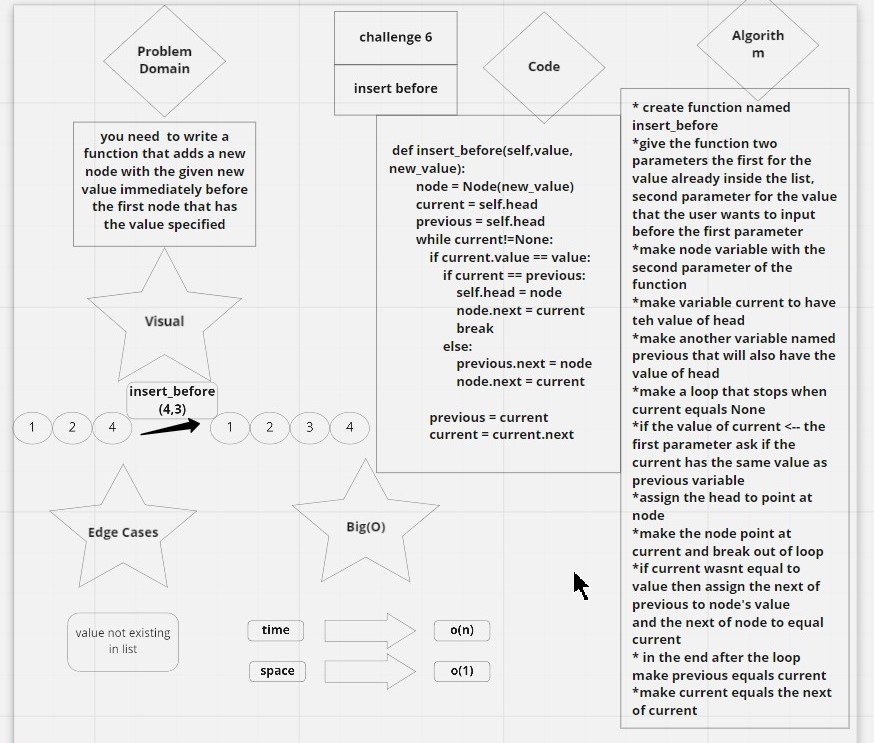

### PULL REQUEST TO CODE CHALLENGE 5
(https://github.com/FirasHasan/401-data-structures-and-algorithms/pull/4)

### LINK TO PULL REQUEST Code Challenge 8
(https://github.com/FirasHasan/401-data-structures-and-algorithms/pull/2)
### PULL REQUEST CHALLENGE 10
(https://github.com/FirasHasan/401-data-structures-and-algorithms/pull/3)

### CHALLENGE 6 
# link to miro
(https://miro.com/app/board/o9J_l5exNKI=/)
# Challenge Summary
- write three functions for linked lists the first is appending to the end of the cell
    - second is to insert a new value before a specific value in the list
    - third is to insert a new value after a specific value in the list

## Whiteboard Process
<!-- Embedded whiteboard image -->
.jpg)

## Approach & Efficiency
time is O(n)
space is O(1)

## Solution
it runs just fine i included the code in the white board and also in these files
all functions are tested and everything runs perfectly

# CHALLENGE 7
# link to pull request:
(https://github.com/FirasHasan/401-data-structures-and-algorithms/pull/9)

# link to miro
(https://miro.com/app/board/o9J_l5exNKI=/)

# Challenge Summary
create a function that has a method that Return the node’s value that is k places from the tail of the linked list.

## Whiteboard Process
<!-- Embedded whiteboard image -->

## Approach & Efficiency
time is O(n)
space is O(1)

## Solution
it runs just fine i included the code in the white board and also in these files
all functions are tested and everything runs perfectly

# CHALLENGE 8

# link to miro
(https://miro.com/app/board/o9J_l5exNKI=/)

# Challenge Summary
need to make a function that Zip the two linked lists together into one so that the nodes alternate between the two lists and return a reference to the head of the zipped list.

## Whiteboard Process
<!-- Embedded whiteboard image -->
.jpg)

## Approach & Efficiency
time is O(n)
space is O(n)

## Solution
it runs just fine i included the code in the white board and also in these files
a test runs and passes successfully

# CHALLENGE 13

# Challenge Summary
<!-- Description of the challenge -->
*you need to write a function that accepts 1 parameter that is a string
then check if the string is a bracket whether parentheses, curly bracket or square bracket, and check if the brackets close correctly

## Whiteboard Process
<!-- Embedded whiteboard image -->

## Approach & Efficiency
<!-- What approach did you take? Why? What is the Big O space/time for this approach? -->
time is o(n)
space is o(1)

## Solution
<!-- Show how to run your code, and examples of it in action -->
it runs just fine i included the code in the white board and also in these files
3 tests runs and passes successfully
