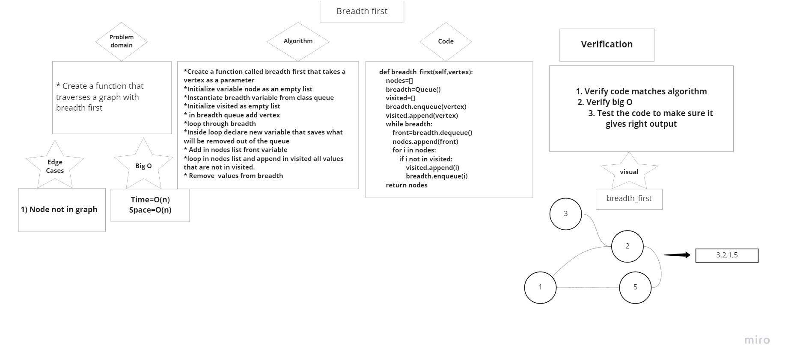

# Graphs
<!-- Short summary or background information -->

- A Graph is a non-linear data structure consisting of nodes and edges. The nodes are sometimes also referred to as vertices and the edges are lines or arcs that connect any two nodes in the graph.

## Challenge
<!-- Description of the challenge -->
- Implement your own Graph. The graph should be represented as an adjacency list, and should include the following methods:

## Approach & Efficiency
<!-- What approach did you take? Why? What is the Big O space/time for this approach? -->
Big O of time: O(1)
Big O of space: O(1)

## API
<!-- Description of each method publicly available in your Graph -->

- add node
Arguments: value
Returns: The added node
Add a node to the graph

- add edge
Arguments: 2 nodes to be connected by the edge, weight (optional)
Returns: nothing
Adds a new edge between two nodes in the graph
If specified, assign a weight to the edge
Both nodes should already be in the Graph

- get nodes
Arguments: none
Returns all of the nodes in the graph as a collection (set, list, or similar)

- get neighbors
Arguments: node
Returns a collection of edges connected to the given node
Include the weight of the connection in the returned collection

- size
Arguments: none
Returns the total number of nodes in the graph.

## Challenge 36 breadth first traverse

# Challenge Summary
<!-- Description of the challenge -->
- You should create a function that traverses a graph with breadth first.

## Whiteboard Process
<!-- Embedded whiteboard image -->

## Approach & Efficiency
<!-- What approach did you take? Why? What is the Big O space/time for this approach? -->
- Time: O(n)
- Space: O(n)

## Solution
<!-- Show how to run your code, and examples of it in action -->
[Code](graph_1.py)
