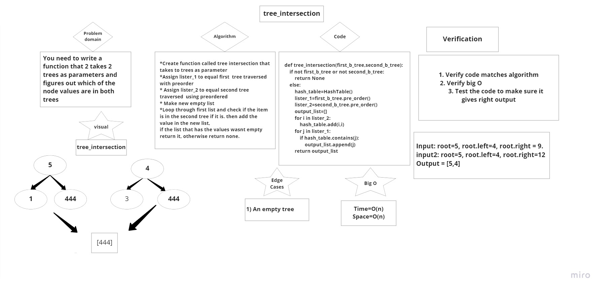

# Hashtables
<!-- Short summary or background information -->
- Hash tables allow the storage and retrieval of data in an average time of O(1). At its most basic level, a hash table data structure is just an array. Data is stored into this array at specific indices designated by a hash function. A hash function is a mapping between the set of input data and a set of integers
- Source from (https://www.sparknotes.com/cs/searching/hashtables/summary/#:~:text=Hash%20tables%20allow%20the%20storage,and%20a%20set%20of%20integers.)
## Challenge
<!-- Description of the challenge -->
- Implement a Hashtable Class with the following methods:
- add, contains, find, hash

## Approach & Efficiency
<!-- What approach did you take? Why? What is the Big O space/time for this approach? -->
- Big O of time is: O(1)
- Big O of space is: O(n)

## API
<!-- Description of each method publicly available in each of your hashtable -->
- add method:
add a value to the hashtable by its key 
parameters:
key: a string
value: any type
Arrgument: key and value 
return: nothing

- find method:
this function will search in the hashtable about the key and return the value
parameters:
key: a string
return: the value 

- contains method: 
this function will check if the there is a value for the key 
parameters:
key: a string
return: a boolean

### repeated word code challenge 31

# Challenge Summary
<!-- Description of the challenge -->
- You need to write a function that takes in a string and returns the first word that is repeated at least once.

## Whiteboard Process
<!-- Embedded whiteboard image -->

Big O of space is: O(n)

## Solution
<!-- Show how to run your code, and examples of it in action -->
[Code Source](hash_table_1.py)
[Code Tests Source](test_hash_table_1.py)

### 32

# Challenge Summary

<!-- Description of the challenge -->

- You need to write a function that 2 takes 2 trees as parameters and figures out which of the node values are in both trees

## Whiteboard Process

<!-- Embedded whiteboard image -->
- 

## Approach & Efficiency
<!-- What approach did you take? Why? What is the Big O space/time for this approach? -->
Time is: O(n)
Space: O(n)
## Solution
<!-- Show how to run your code, and examples of it in action -->
[Code Source](hash_table_1.py)
[Test Source](test_hash_table_1.py)