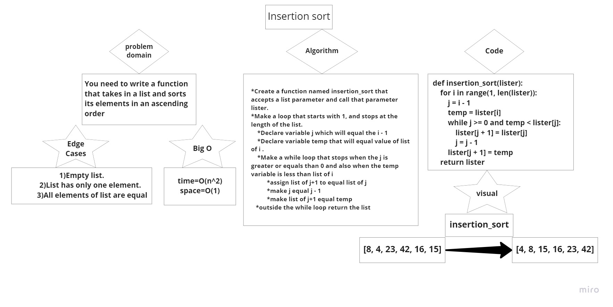

# Insertion Sort
- Insertion Sort is a sorting algorithm that traverses the array multiple times as it slowly builds out the sorting sequence. The traversal keeps track of the minimum value and places it in the front of the array which is incrementally sorted.

# Trace
- Input [8, 4, 23, 42, 16, 15]
- Output [4, 8, 15, 16, 23, 42]

1. In the first pass through of the selection sort, we evaluate if there is a smaller number in the array than what is currently present in index 0. We find this smaller number right away in index 1. The minimum value gets updated to remember this index. At the end of the evaluation, the smaller number will be swapped with the current value in index i. This results in our smallest number of our array being placed first.

2. The second pass through the array evaluates the remaining values in the array to see if there is a smaller value other than the current position of i. 8 is the 2nd smallest number in the array, so it “swaps” with itself. The minimum value does not change at all during the iteration of this pass.

3. The third pass through evaluates the remaining indexes in the array, starting at position 2. Both position 4 and 5 are smaller than the value in position 2. Each time a smaller number than the current minimum is found, the variable will update to the new smallest number. In this case, 15 is the next smallest number. As a result, it will swap with position 2.

4. The 4th pass through on the array proves that 16 is the next smallest number in the array, and as a result, switches places with the 42.

5. The 5th pass through of the array only has one other index to evaluate. Since the last index value is larger than index 4, the two values will swap.

6. On its final iteratation through the array, it will swap places with itself as it evaluates the value against itself.
After this iteration, i will increment to 6, forcing it to break out of the outer for loop and leaving our array now sorted.

# Pseudocode
-   SelectionSort(int[] arr)
    DECLARE n <-- arr.Length;
    FOR i = 0; i to n - 1  
        DECLARE min <-- i;
        FOR j = i + 1 to n
            if (arr[j] < arr[min])
                min <-- j;

        DECLARE temp <-- arr[min];
        arr[min] <-- arr[i];
        arr[i] <-- temp;

# Big O Notaion (Efficiency)
- Big O of time complexity is: O(n^2)
- Big O of space complexity is: O(1)

# Link to pull request
- [Click here to go to github pull request for this assignment.](https://github.com/FirasHasan/401-data-structures-and-algorithms/pull/22)

# Whiteboard image
- 