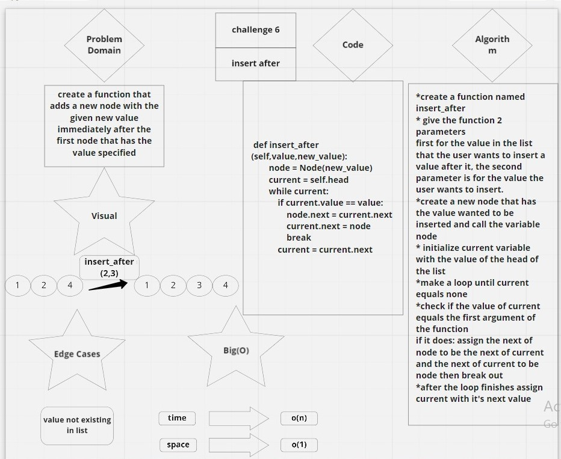
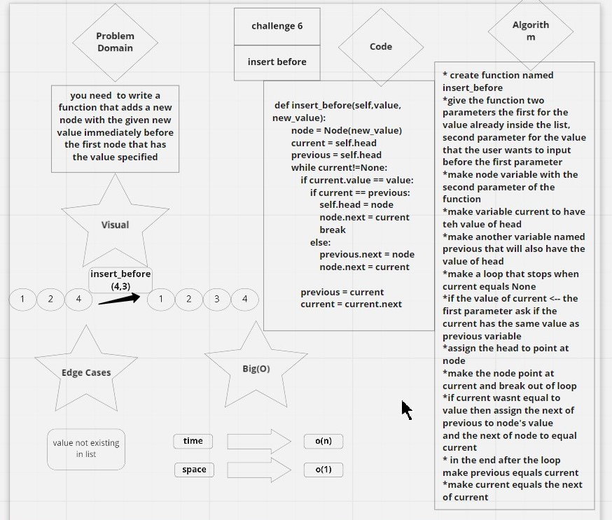
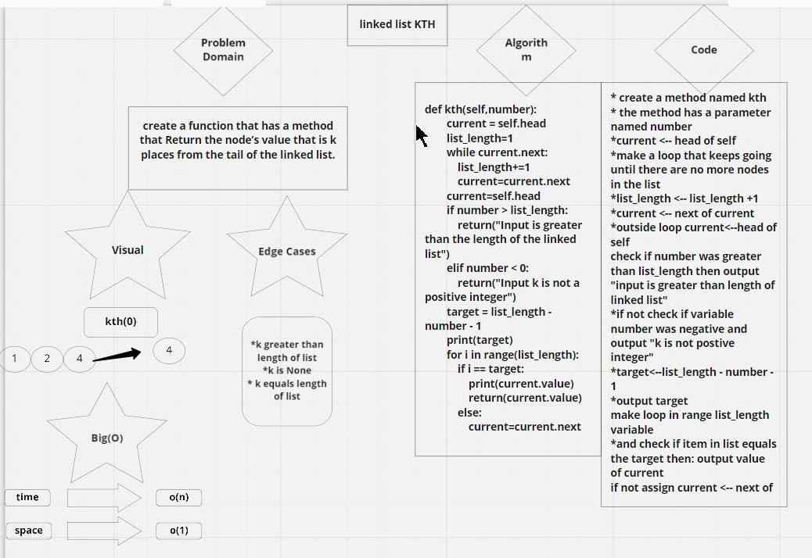

#  PULL REQUEST TO CODE CHALLENGE 5
[click to go to pull request for code challenge 5](https://github.com/FirasHasan/401-data-structures-and-algorithms/pull/4)

# CHALLENGE 6 
# link to miro
(https://miro.com/app/board/o9J_l5exNKI=/)
# Challenge Summary
- write three functions for linked lists the first is appending to the end of the cell
    - second is to insert a new value before a specific value in the list
    - third is to insert a new value after a specific value in the list

## Whiteboard Process
<!-- Embedded whiteboard image -->
.jpg)

## Approach & Efficiency
time is O(n)
space is O(1)

## Solution
it runs just fine i included the code in the white board and also in these files
all functions are tested and everything runs perfectly

# CHALLENGE 7
# link to pull request:
(https://github.com/FirasHasan/401-data-structures-and-algorithms/pull/9)

# link to miro
(https://miro.com/app/board/o9J_l5exNKI=/)

# Challenge Summary
create a function that has a method that Return the node’s value that is k places from the tail of the linked list.

## Whiteboard Process
<!-- Embedded whiteboard image -->

## Approach & Efficiency
time is O(n)
space is O(1)

## Solution
it runs just fine i included the code in the white board and also in these files
all functions are tested and everything runs perfectly

# CHALLENGE 8

# link to miro
(https://miro.com/app/board/o9J_l5exNKI=/)

# Challenge Summary
need to make a function that Zip the two linked lists together into one so that the nodes alternate between the two lists and return a reference to the head of the zipped list.

## Whiteboard Process
<!-- Embedded whiteboard image -->
.jpg)

## Approach & Efficiency
time is O(n)
space is O(n)

## Solution
it runs just fine i included the code in the white board and also in these files
a test runs and passes successfully

# LINK TO PULL REQUEST Code Challenge 8
[click for pull request code challenge 8 ](https://github.com/FirasHasan/401-data-structures-and-algorithms/pull/2)
## miro 
[click for miro white board 8](https://miro.com/app/board/o9J_l5exNKI=/)

# PULL REQUEST FOR CODE CHALLENGE 9
[click for miro link  for code challenge 9](https://miro.com/app/board/o9J_l5exNKI=/)