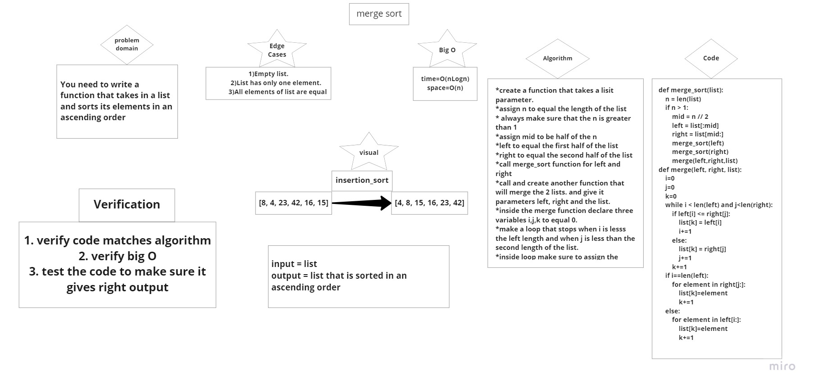

# Merge sort
## Link to pull request
(https://github.com/FirasHasan/401-data-structures-and-algorithms/pull/23)
 
## [Link to BLOG](BLOG.md)

# Challenge Summary
<!-- Description of the challenge -->
- You need to write a function that takes in a list and sorts its elements in an ascending order
## Whiteboard Process
<!-- Embedded whiteboard image -->

## Approach & Efficiency
<!-- What approach did you take? Why? What is the Big O space/time for this approach? -->
Big O of time = O(nLogn)
Big O of space = O(n)

## Solution
<!-- Show how to run your code, and examples of it in action -->
def merge_sort(list):
    n = len(list)
    if n > 1:
        mid = n // 2
        left = list[:mid]
        right = list[mid:]

        merge_sort(left)
        merge_sort(right)
        merge(left,right,list)

def merge(left, right, list):
    i=0
    j=0
    k=0
    while i < len(left) and j<len(right):
        if left[i] <= right[j]:
            list[k] = left[i]
            i+=1
        else:
            list[k] = right[j]
            j+=1
        k+=1
    if i==len(left):
        for element in right[j:]:
            list[k]=element
            k+=1
    else:
        for element in left[i:]:
            list[k]=element
            k+=1
