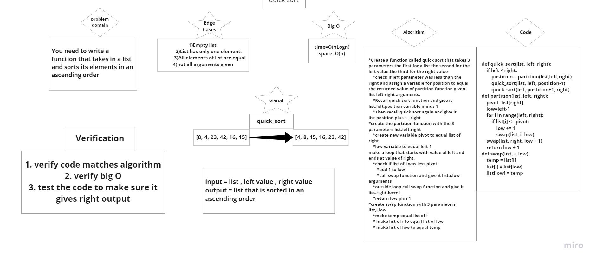

# Quick Sort

# Challenge Summary
<!-- Description of the challenge -->
- You need to write a function that takes in a list and sorts its elements in an ascending order
## Whiteboard Process
<!-- Embedded whiteboard image -->
- 
## Approach & Efficiency
<!-- What approach did you take? Why? What is the Big O space/time for this approach? -->
- Big O of time = O(nLogn)
- Big O of space = O(n)

## Solution
<!-- Show how to run your code, and examples of it in action -->
- [Click to see actual code](quick_sort_1.py)
- [Click to see code tests](test_quick_sort_1.py)

## [Link to Blog](BLOG.md)