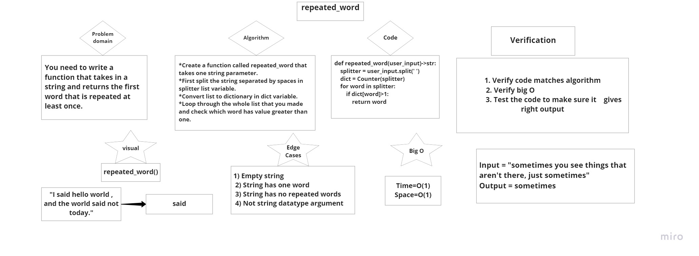

# Challenge Summary
<!-- Description of the challenge -->
- You need to write a function that takes in a string and returns the first word that is repeated at least once.

## Whiteboard Process
<!-- Embedded whiteboard image -->

## Approach & Efficiency
<!-- What approach did you take? Why? What is the Big O space/time for this approach? -->
Big O of time is: O(n)
Big O of space is: O(1)

## Solution
<!-- Show how to run your code, and examples of it in action -->
[Code Source](repeated_word.py)
[Code Tests Source](test_repeated_word.py)