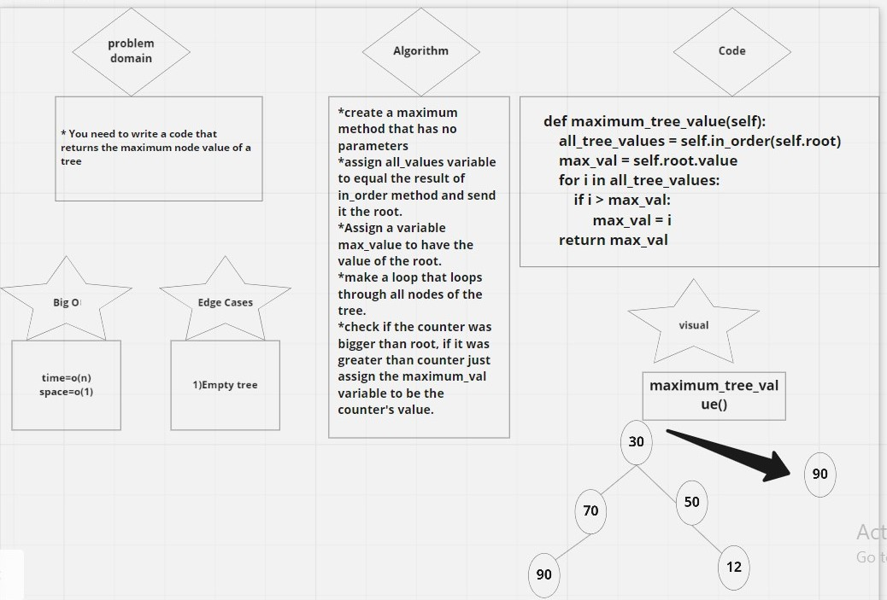
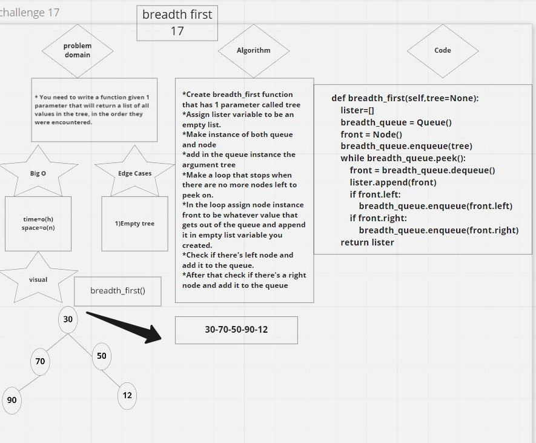

# Code challenge 15
# Trees
<!-- Short summary or background information -->
- A tree is a hierarchical data structure defined as a collection of nodes. Nodes represent value and nodes are connected by edges. A tree has the following properties: The tree has one node called root
## Challenge
<!-- Description of the challenge -->
1. You need to make a Binary tree class that uses 3 methods for traversing nodes 
    - preorder
    - inorder
    - postorder
- Make a binary search tree    

## Approach & Efficiency
<!-- What approach did you take? Why? What is the Big O space/time for this approach? -->
1. Binary tree 3 traversals 
    - Big O of time is O(n)
    - Big O of space is O(n)
2. Binary search tree
    - Big o of time is O(n)
    - Big O of space is O(n)

## API
<!-- Description of each method publicly available in each of your trees -->
- Pre order starts with the root then left then right nodes.
- In order method starts with left then root then right.
- Post order starts with left nodes then right nodes and then the root.

# code challenge 16 maximum tree value
# Challenge Summary
<!-- Description of the challenge -->
- You need to write a method of class tree that returns the maximum node value in the tree.
## Whiteboard Process
<!-- Embedded whiteboard image -->

## Approach & Efficiency
<!-- What approach did you take? Why? What is the Big O space/time for this approach? -->
- Time = o(n)
- space = o(1)

## Solution
<!-- Show how to run your code, and examples of it in action -->
- The code runs and gives the right result. A test is written and the right result is returned.

# Code challenge 17 

# Challenge Summary
<!-- Description of the challenge -->
- You need to write a function given 1 parameter that will return a list of all values in the tree, in the order they were encountered.
## Whiteboard Process
<!-- Embedded whiteboard image -->

## Approach & Efficiency
<!-- What approach did you take? Why? What is the Big O space/time for this approach? -->
- Big O of time complexity is o(h) which means it depends on the height of the tree
- Big O of space complexity is o(n)
## Solution
<!-- Show how to run your code, and examples of it in action -->
- My code is still not working properly, it needs some changes.

# challenge 18

# Challenge Summary
<!-- Description of the challenge -->
You need to write a function that replaces all nodes with 'FizzBuzz' if the answer was 0 when doing mode on 3 and 5
and replace nodes with 'Fizz' if nodes were only equals 0 if mode by 3
and replaces nodes with 'Buzz' if nodes were equal 0 when doing mode by 5 
## Whiteboard Process
<!-- Embedded whiteboard image -->

## Approach & Efficiency
<!-- What approach did you take? Why? What is the Big O space/time for this approach? -->
- Big O of time complexity is o(n) 
- Big O of space complexity is o(n)

## Solution
<!-- Show how to run your code, and examples of it in action -->
- still working on it
